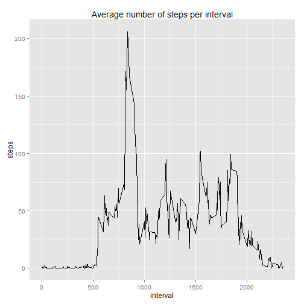
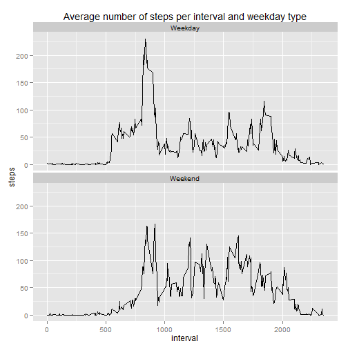

# Reproducible Research: Peer Assessment 1

This document presents the code of the Peer Assessment 1 of the Coursera course "Reproducible Research". It includes all the code and results, as well as explanatory comments.

This assignment makes use of data from a personal activity monitoring device. This device collects data at 5 minute intervals through out the day. The data consists of two months of data from an anonymous individual collected during the months of October and November, 2012 and include the number of steps taken in 5 minute intervals each day.

Locale options are set to English.


```r
Sys.setlocale("LC_ALL", "English")
```

```
## [1] "LC_COLLATE=English_United States.1252;LC_CTYPE=English_United States.1252;LC_MONETARY=English_United States.1252;LC_NUMERIC=C;LC_TIME=English_United States.1252"
```


## Loading and preprocessing the data

Data is unzipped and then loaded using the `read.csv()` function.


```r
unzip("activity.zip")
data = read.csv("activity.csv")
```


The first 6 values of the data are


```r
head(data)
```

```
##   steps       date interval
## 1    NA 2012-10-01        0
## 2    NA 2012-10-01        5
## 3    NA 2012-10-01       10
## 4    NA 2012-10-01       15
## 5    NA 2012-10-01       20
## 6    NA 2012-10-01       25
```


## What is mean total number of steps taken per day?

The following histogram shows the total number of steps taken each day. It must be noted, that for the first part of the assignment, **missing values are omitted**.


```r
require(ggplot2)
```

```
## Loading required package: ggplot2
```

```r
stepsDateSum = aggregate(steps ~ date, data, sum)
ggplot(data = stepsDateSum, aes(x = steps)) + geom_bar(stat = "bin")
```

```
## stat_bin: binwidth defaulted to range/30. Use 'binwidth = x' to adjust this.
```

 


The mean total number of steps taken per day is


```r
mean(stepsDateSum$steps)
```

```
## [1] 10766
```


and the median total number of steps taken per day is


```r
median(stepsDateSum$steps)
```

```
## [1] 10765
```


## What is the average daily activity pattern?

The following plot shows the average number of steps per each interval along all days


```r
stepsIntervalMean = aggregate(steps ~ interval, data, mean)
ggplot(data = stepsIntervalMean, aes(x = interval, y = steps)) + geom_line() + 
    ggtitle("Average number of steps per interval")
```

 


The maximum number of steps is equal to 


```r
max(stepsIntervalMean$steps)
```

```
## [1] 206.2
```


and it is reached at the following interval


```r
stepsIntervalMean$interval[which.max(stepsIntervalMean$steps)]
```

```
## [1] 835
```


## Imputing missing values

The total number of missing values in the data set is


```r
sum(is.na(data$steps))
```

```
## [1] 2304
```


A new dataset is created filling the missing values with the mean of their corresponding interval.


```r
data2 = data
na_positions = is.na(data$steps)
data2$steps[na_positions] = stepsIntervalMean$steps[match(data2$interval[na_positions], 
    stepsIntervalMean$interval)]
```


The following histogram shows the total number of steps taken each day of the new dataset.


```r
stepsDateSum2 = aggregate(steps ~ date, data2, sum)
ggplot(data = stepsDateSum2, aes(x = steps)) + geom_bar(stat = "bin")
```

```
## stat_bin: binwidth defaulted to range/30. Use 'binwidth = x' to adjust this.
```

 


The mean total number of steps taken per day with the new dataset is


```r
mean(stepsDateSum2$steps)
```

```
## [1] 10766
```


and the median total number of steps taken per day with the new dataset is


```r
median(stepsDateSum2$steps)
```

```
## [1] 10766
```


The difference between the mean in the first dataset and the new dataset is


```r
mean(stepsDateSum2$steps) - mean(stepsDateSum$steps)
```

```
## [1] 0
```


Similarly, the difference between the median in the first dataset and the new one is


```r
median(stepsDateSum2$steps) - median(stepsDateSum$steps)
```

```
## [1] 1.189
```


As it can be seen, the mean has not changed, while the median has experienced a slight increase. This is because the missing values have been filled with the mean of their corresponding interval, so the new mean has remained unchanged. The median has been increased because the total number of values in the dataset has changed.


## Are there differences in activity patterns between weekdays and weekends?

In order to analyse the differences between weekdays and weekends, a new factor column is added to the new dataset. This column identifies weekdays and weekend days.


```r
data2$dateType = as.factor(ifelse(weekdays(as.Date(data2$date)) %in% c("Sunday", 
    "Saturday"), "Weekend", "Weekday"))
```


The following panel plot shows the average number of steps taken per each 5-minute interval, averaged across all weekday days or weekend days.


```r
stepsIntervalMean2 = aggregate(steps ~ interval + dateType, data2, mean)
ggplot(data = stepsIntervalMean2, aes(x = interval, y = steps)) + facet_wrap(~dateType, 
    nrow = 2) + geom_line() + ggtitle("Average number of steps per interval and weekday type")
```

 


